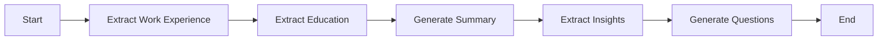

# Resume Analysis Workflow with LangGraph, LangChain & FastAPI

**By Pathan Afnan Khan — AI Engineer | Data Scientist | Agentic AI Engineer**

A production-oriented resume analysis API built with **LangGraph**, **LangChain**, **FastAPI**, and validated Pydantic models. The workflow extracts structured resume data, generates summaries and insights, creates interview questions, streams results in real time, and supports workflow persistence through checkpoints.

[Portfolio](https://pathan-afnan-khan.vercel.app/) · [Related Case Study](https://pathan-afnan-khan.vercel.app/projects/resume-analyzer-rag) · [GitHub Profile](https://github.com/PathanAfnanKhan020319) · [LinkedIn](https://www.linkedin.com/in/afnan-khan4/)

## Core capabilities

- Structured extraction of work experience and education.
- AI-generated professional summaries and insights.
- Tailored interview-question generation.
- Real-time Server-Sent Events (SSE) streaming.
- SQLite-backed checkpointing for workflow persistence and resumption.
- Pydantic validation and modular LangGraph nodes.
- Docker-ready deployment, health checks, logging, and test coverage.

## Architecture



## Tech stack

`Python` · `FastAPI` · `LangGraph` · `LangChain` · `Pydantic` · `OpenAI` · `SQLite` · `Docker` · `SSE`

## Key workflow nodes

| Node | Purpose |
| --- | --- |
| `extract_work` | Extract structured work-experience data |
| `extract_education` | Extract structured education data |
| `generate_summary` | Generate a professional resume summary |
| `extract_insights` | Identify important candidate insights |
| `generate_questions` | Create tailored interview questions |

## API endpoints

### `POST /analyze-resume`
Analyzes a resume and streams results in real time.

### `POST /resume-questions`
Generates additional questions from a saved checkpoint.

### `GET /health`
Health endpoint for service monitoring.

## Quick start

```bash
git clone https://github.com/PathanAfnanKhan020319/resume-analyzer1.git
cd resume-analyzer1
python -m venv venv
# Windows: venv\Scripts\activate
# macOS/Linux: source venv/bin/activate
pip install -r requirements.txt
```

Create a `.env` file:

```env
OPENAI_API_KEY=your_openai_api_key_here
LOG_LEVEL=INFO
MAX_WORKERS=1
```

Run the API:

```bash
uvicorn app.main:app --reload --host 0.0.0.0 --port 8000
```

Interactive docs:

- Swagger UI: `http://localhost:8000/docs`
- ReDoc: `http://localhost:8000/redoc`

## Docker

```bash
docker build -t resume-analyzer .
docker run -p 8000:8000 --env-file .env resume-analyzer
```

## Production considerations

- Keep secrets in environment variables.
- Add authentication and rate limiting before public deployment.
- Use HTTPS and production CORS configuration.
- Monitor latency, error rates, checkpoint storage, and LLM failures.
- Consider Redis or another shared state layer when scaling horizontally.

## Related portfolio work

For a broader view of my resume intelligence, RAG, retrieval, and AI engineering work:

**https://pathan-afnan-khan.vercel.app/projects/resume-analyzer-rag**

More projects: **https://pathan-afnan-khan.vercel.app/projects**

---

**Pathan Afnan Khan**  
AI Engineer · Data Scientist · Agentic AI Engineer  
Portfolio: https://pathan-afnan-khan.vercel.app/
